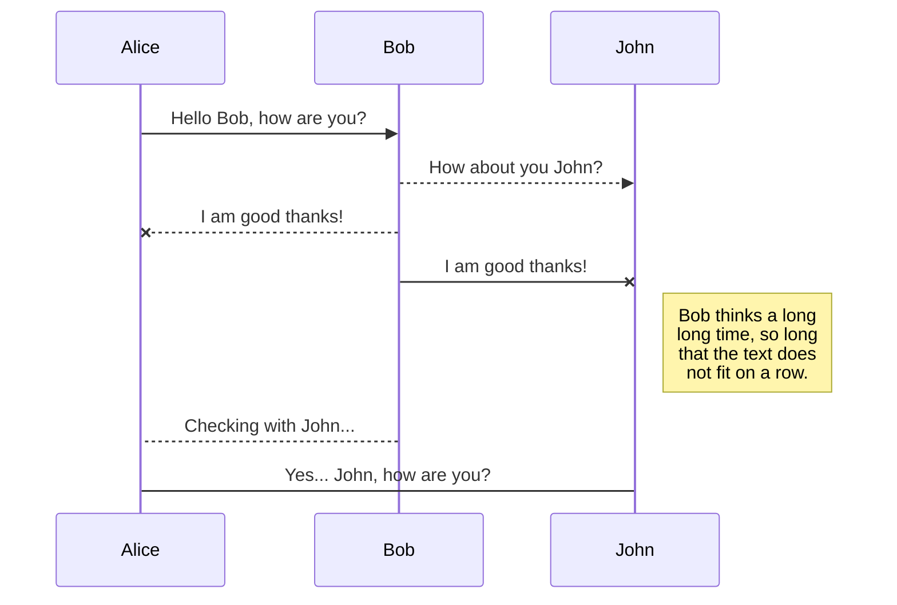

# Automation-Actions

A curated sample of scripts to speed up diagnostics and remediation for PagerDuty's Automation Actions

# PDCLI.


| # |Name  |Description  |Prerequisites  |
|--|--|--|--|--| --
| 1| inventory.sh | Basic Information regarding a local server |None  |
| 2| systemealth.sh | CPU,Memory,Swap Space,Disk Space |  |
| 3|filehogs.sh  |List top x files for size  |  |
| 4|cleantempdir.sh  |Housekeeping  |  |
| 5|logparse.sh  |Parse a log and add markers  |  |
| 6|enpointcheck.sh  |Check endpoint availability and return a marker|  |
| 7|kubernetespods.sh  |Check pod status for namespace and mark  |  |
| 8|loginremote.sh  |Sample login to remote server  |  |
| 9|rebootremote.sh  |Sample login and remote reboot  |  |
| 10|containerlogs.sh  |Parse container logs for errors|  |


## UML diagrams

You can render UML diagrams using [Mermaid](https://mermaidjs.github.io/). For example, this will produce a sequence diagram:



And this will produce a flow chart:

```mermaid
graph LR
A[Square Rect] -- Link text --> B((Circle))
A --> C(Round Rect)
B --> D{Rhombus}
C --> D**